# How to install Java and Eclipse

## How to install Java

* Go to [java.com/en/download].
* Click **"Agree and Start Free Download"**:


* Save file in prefferred location:


* Run the **.exe** file (double click on it) and click **"Yes"**.
* Tick the **"Change destination folder"** box, click **"Install"**, and wait for installation:

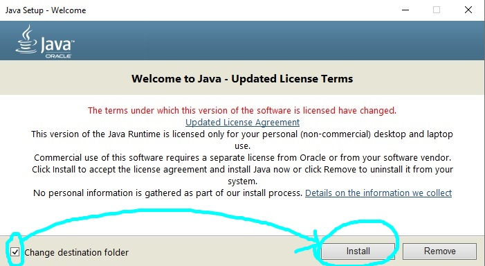

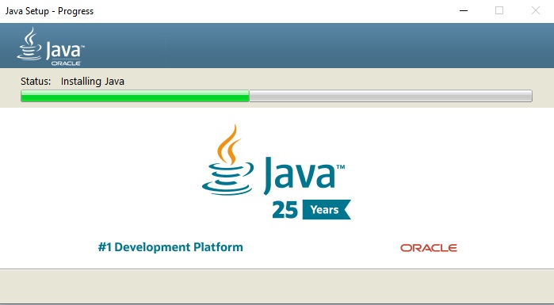

* You have successfully installed Java should display after install. Click **"Close"**:


 	
* To check installation, open **Command Prompt**:


* Type the following command and press Enter:

```
java -version
```

* The current version should be displayed:


## How to install Eclipse

To run Java, you need an [**IDE**], we reccommend **Eclipse**.

* Go to [**eclipse.org/downloads**].
* Click "Download":

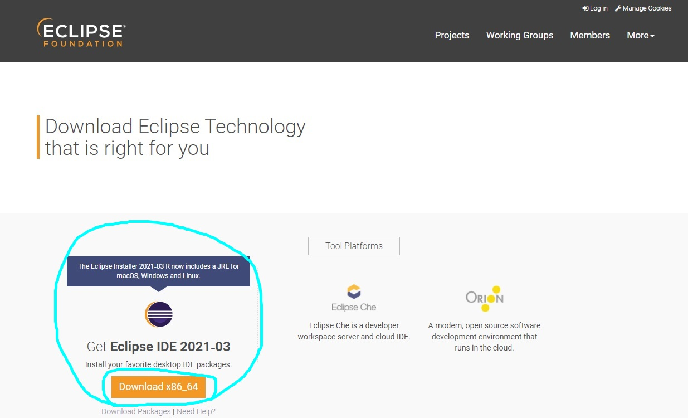

* Select Get Eclipse IDE 2021-03 and click **"Download x86_64"**:

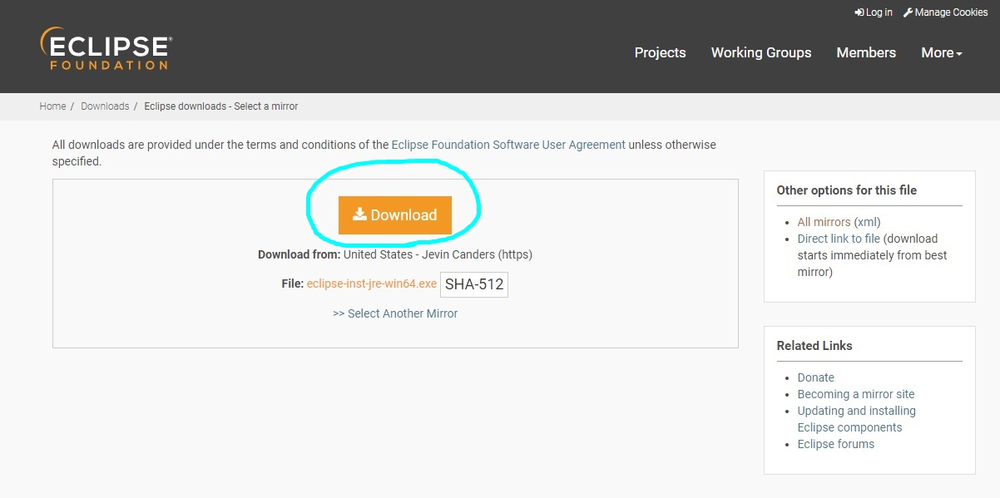

* Save file to preferred location:

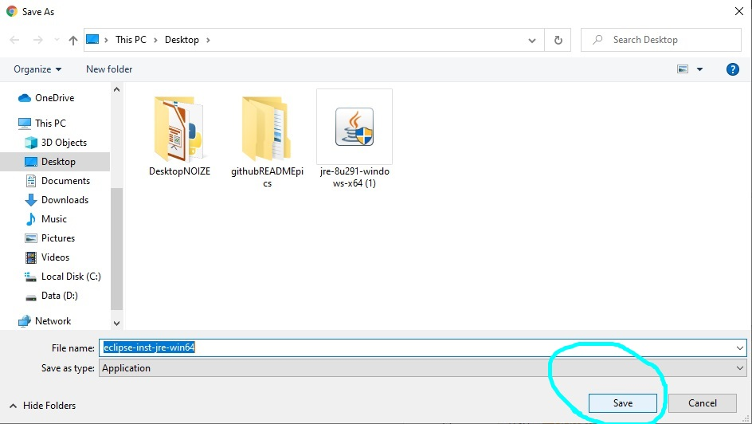
	
* Run the **.exe** file (double click on it) - **eclipseinstaller** should display.

* Select **"Eclipse IDE for Java Developers"**:

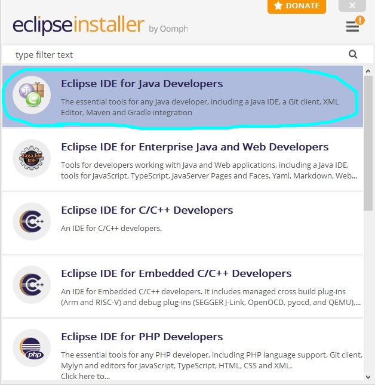

* Choose your destination folder and click **"Install"**:


* Click **"Accept now"** on the **User Agreement**:

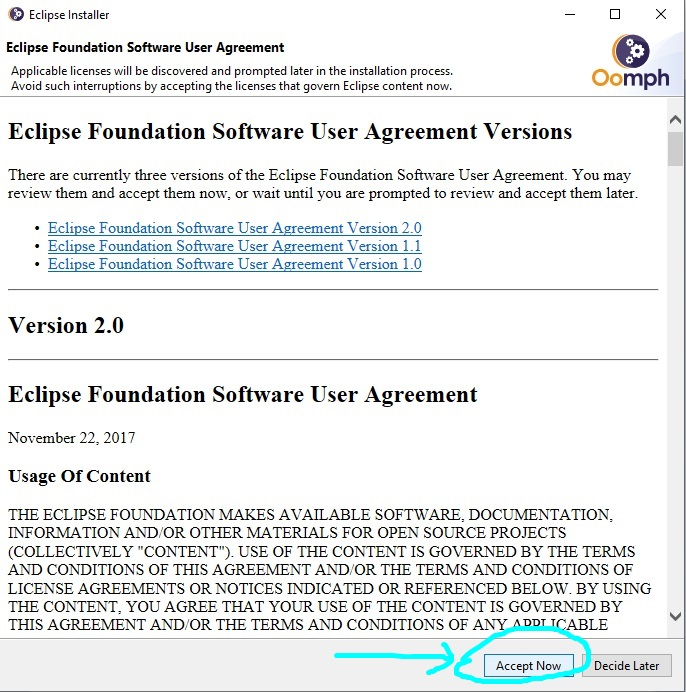

* Wait for installation and click **"Launch"**:


* Choose your destination folder for Eclipse workspace (this will store all your Java projects) and click **"Launch"**:

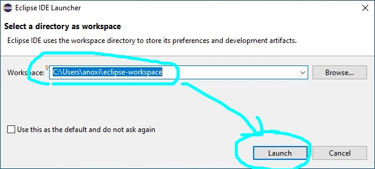

* Eclipse Welcome screen should be displayed:


## How to run a program via Eclipse

* Select **"File > New>Java Project"**:

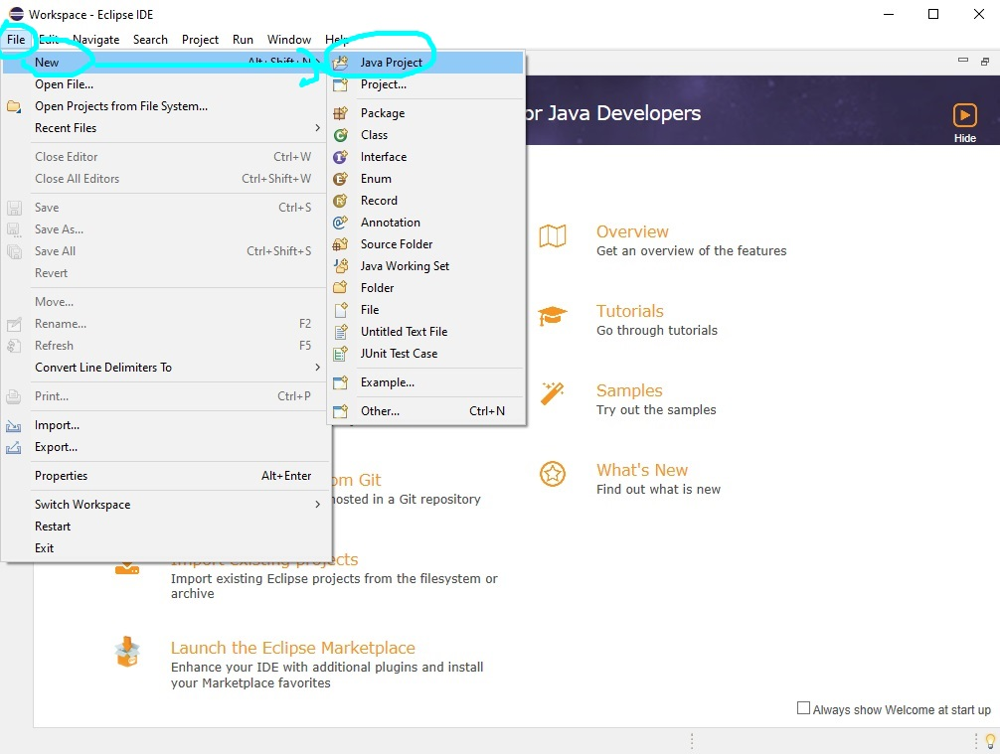

* Enter the new project name:

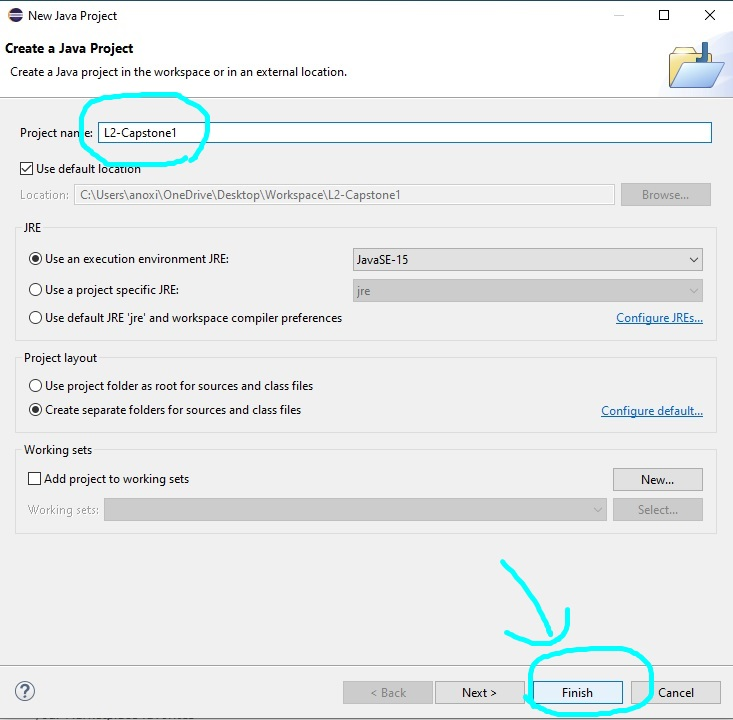

* Select small **"J"** icon to the right and close **welcome** tab.
* You should see the created folder in the **Package Explorer**.
* Navigate to **"src"**:


* Copy the **.java** files from where you saved them into **"src"**:

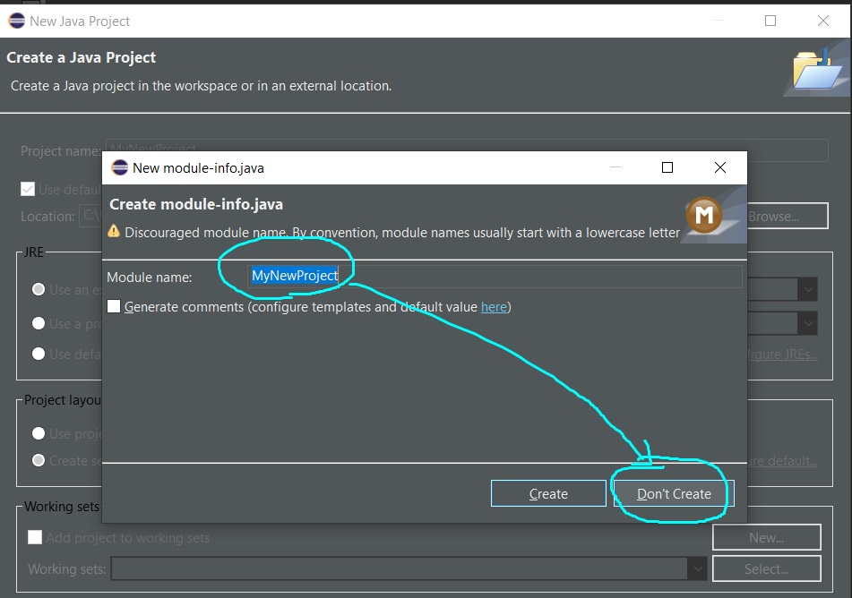
	
* Double click on a file to open it in the compiler:

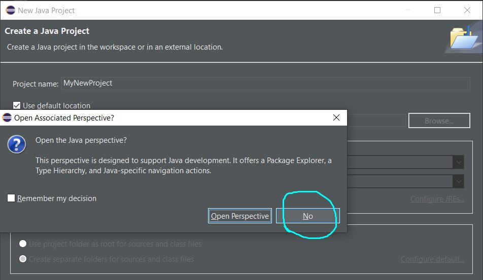

* To run them, select **"Run"** tab and click **"Run"**:

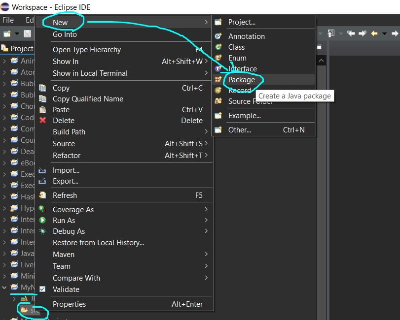

* You should now see the program running in the Eclipse Console:

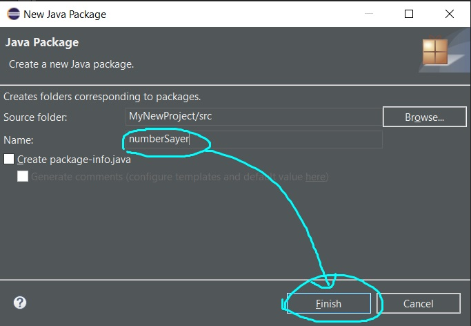

And that's it! You're all set up!

